**Appendix**

**Formula**

**1. Random Fluctuations and Why They Are Used**

-   **Reason**: Engagement levels in real-world systems (e.g.,
    healthcare participation) are inherently unpredictable and
    influenced by numerous factors such as personal behavior, external
    policies, or environmental changes.

-   **Purpose in the Simulation**:

    -   They introduce variability, making the model more realistic by
        simulating both increases and decreases in engagement levels
        over time.

    -   Random fluctuations also allow the model to reflect potential
        short-term disruptions (e.g., staff shortages, new initiatives).

-   **Example**: If \"Patients\" engagement starts at 0.6 and fluctuates
    randomly within \[−0.02,+0.02\]\[-0.02, +0.02\]\[−0.02,+0.02\], the
    variability mimics real-world behaviors such as patients being more
    engaged during health campaigns and less engaged during holidays.

**2. Uptake Rate and Why It Is Used**

-   **Reason**: The uptake rate summarizes the system\'s overall
    engagement by averaging the contributions of all stakeholder groups
    (patients, doctors, nurses, administrators).

-   **Purpose in the Simulation**:

    -   It provides a high-level metric to evaluate the program\'s
        success.

    -   By tracking uptake over time, it identifies patterns and trends
        that can inform decision-making (e.g., whether engagement is
        improving or declining).

    -   Aggregating individual engagement levels into a single uptake
        rate is useful for comparing across time or scenarios.

-   **Example**: If engagement for doctors is high but low for
    administrators, the uptake rate highlights this gap. Monitoring it
    monthly ensures timely adjustments.

**3. Feedback Loop and Why It Is Used**

-   **Reason**: Engagement in one period influences future
    participation, as people's behavior often follows momentum (positive
    or negative). For instance:

    -   A stakeholder\'s higher engagement in one month could lead to
        better results or satisfaction, encouraging continued
        involvement.

    -   Conversely, disengagement could compound due to frustration,
        leading to further drops.

-   **Purpose in the Simulation**:

    -   The feedback loop captures these cascading effects, helping
        simulate long-term dynamics.

    -   It reflects realistic cause-and-effect relationships, showing
        how policies or external shocks affect sustained participation.

-   **Example**: If \"Doctors\" engagement decreases slightly in Month
    2, the new lower level sets the baseline for Month 3, leading to a
    compounding effect unless counteracted by positive fluctuations.

**4. Visualizing Trends and Why It Is Important**

-   **Reason**: Trends over time help stakeholders understand the
    overall direction of the system and pinpoint areas for intervention.

-   **Purpose in the Simulation**:

    -   Identifying whether engagement levels are increasing, stable, or
        declining over time helps evaluate program success.

    -   Visualization simplifies complex data, making it accessible for
        decision-makers.

-   **Example**: A plot showing consistent drops in administrator
    engagement could prompt targeted measures (e.g., new training or
    incentives).

**Why Combine These Elements?**

-   **Holistic Analysis**: The combination of random fluctuations,
    uptake rate, and feedback loop provides a realistic, dynamic view of
    how engagement evolves over time.

-   **Practical Decision-Making**: Decision-makers can:

    -   Evaluate overall system health (via uptake rate).

    -   Understand variability and uncertainty (via random
        fluctuations).

    -   Plan interventions (based on trend analysis and feedback loops).

In summary, these features ensure that the simulation closely mirrors
real-world complexities, allowing for actionable insights and effective
planning in dynamic systems like healthcare.

**Numerical Example - Simulation Steps**

-   Step 1: Define Initial Engagement Levels

-   Step 2: Simulate Engagement Fluctuations for 12 Months

-   Step 3: Calculate Uptake Rate for Month 2

-   Step 4: Simulate for Month 3

-   Step 5: Calculate Uptake Rate for Month 3

-   Step 6: Repeat for Remaining Months

**Step 1: Define Initial Engagement Levels**

We begin with the following **initial engagement levels** for each
stakeholder:

-   **Patients**: 0.6 (60% engaged)

-   **Doctors**: 0.8 (80% engaged)

-   **Nurses**: 0.75 (75% engaged)

-   **Administrators**: 0.5 (50% engaged)

**Step 2: Simulate Engagement Fluctuations for 12 Months**

Next, we apply random fluctuations (within the range
\[−0.05,+0.05\]\[-0.05, +0.05\]\[−0.05,+0.05\]) each month to the
initial engagement levels. Let\'s simulate this process over the first
few months, keeping the fluctuations smaller for simplicity.

**Month 1:**

-   **Initial Engagement** (for all stakeholders):

    -   **Patients**: 0.6

    -   **Doctors**: 0.8

    -   **Nurses**: 0.75

    -   **Administrators**: 0.5

**Month 2 (First Fluctuation):\
**Assume the random fluctuations for each stakeholder are as follows:

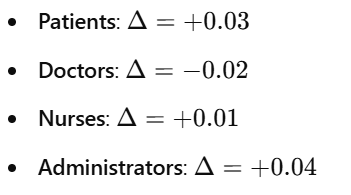{width="2.437625765529309in"
height="1.3542366579177603in"}

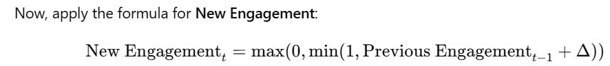{width="5.814448818897638in"
height="0.6365715223097113in"}

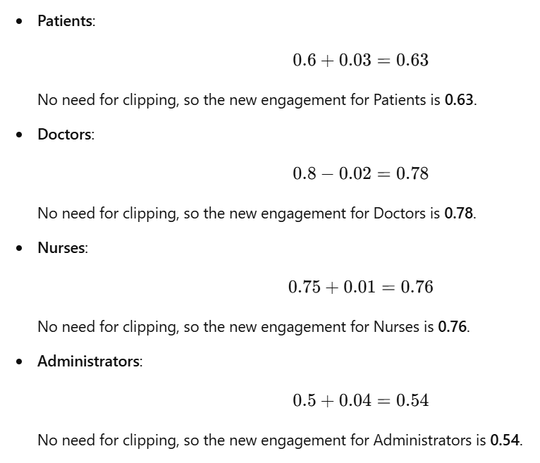{width="4.872654199475066in"
height="4.179286964129484in"}

**Month 2 Engagement Levels:**

-   **Patients**: 0.63

-   **Doctors**: 0.78

-   **Nurses**: 0.76

-   **Administrators**: 0.54

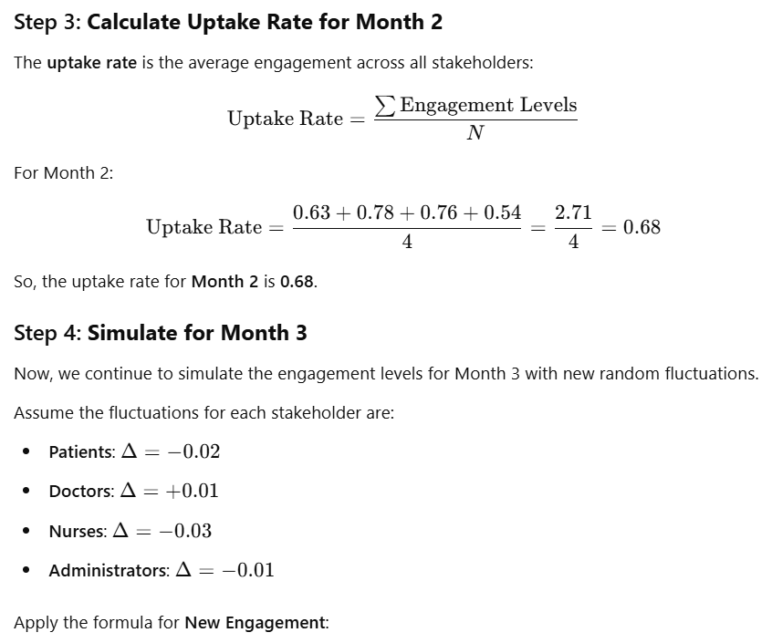{width="5.875301837270341in"
height="4.896084864391951in"}

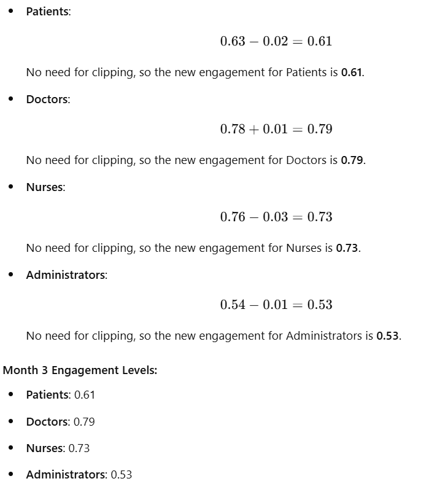{width="4.944698162729659in"
height="5.562785433070866in"}

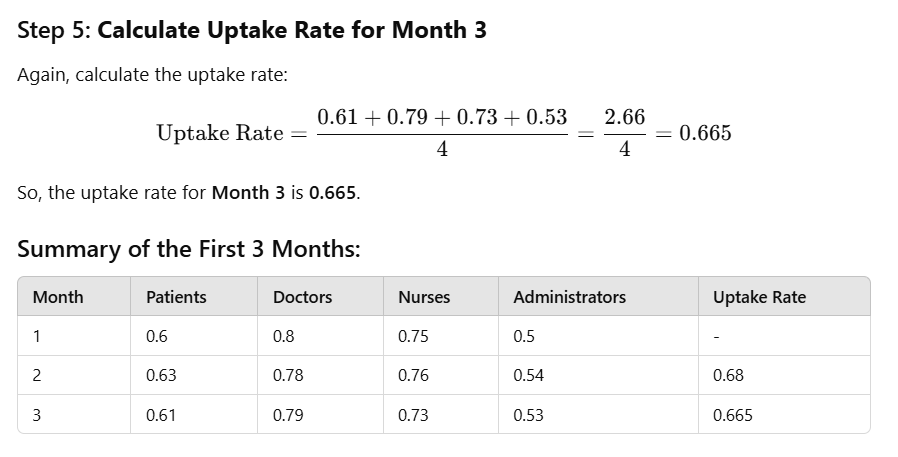{width="5.760622265966754in"
height="2.9316305774278217in"}

**Step 6: Repeat for Remaining Months**

The same process is repeated for the remaining months (Month 4 to Month
12), where new fluctuations are applied each month to simulate the
evolution of engagement levels and the corresponding uptake rate. The
final uptakes are plotted over time to visualize the model's
performance.

**Final Thoughts:**

This numerical example illustrates how:

-   Engagement levels fluctuate based on random changes each month.

-   The uptake rate is calculated as the average of the engagement
    levels.

-   A feedback loop exists, where each month\'s engagement influences
    the next, and this pattern can be visualized to see the overall
    trend.

By running the entire code, we will get a series of engagement levels
and uptake rates, which help simulate and analyze the healthcare
participatory model.

**Formula for Simulating Engagement:**

For each stakeholder, the engagement level fluctuates over 12 months
based on a random fluctuation range, where the fluctuation is defined as
±5% (0.05) of the previous month\'s engagement level. The formula for
updating the engagement level each month is:

{width="6.5in"
height="5.433333333333334in"}

In the context of this code, **engagement** refers to the level of
involvement, participation, or interaction that different stakeholder
groups (such as **patients**, **doctors**, **nurses**, and
**administrators**) have with a given project, platform, or system over
time. It is typically a measure of how actively these groups are
engaging with certain activities, services, or interventions.

**Key Points about Engagement:**

-   **Quantitative Representation**: In the code, engagement is
    represented as a value between **0 and 1**, where:

    -   **0** indicates **no engagement** (complete disengagement or no
        interaction),

    -   **1** indicates **full engagement** (maximum possible
        participation or interaction).

-   **Fluctuations Over Time**: The engagement levels can change over
    time, which is reflected by the fluctuating values in the
    simulation. For example, engagement could increase if a stakeholder
    group becomes more involved or decrease if they lose interest or
    face barriers to participation.

-   **Stakeholder Groups**: The engagement level is simulated for
    different groups, such as:

    -   **Patients**: How involved patients are in a healthcare system,
        project, or study.

    -   **Doctors**: The degree of participation or involvement of
        doctors in a healthcare setting or initiative.

    -   **Nurses**: The level of engagement of nursing staff in
        activities, events, or initiatives.

    -   **Administrators**: The level of involvement of administrative
        personnel in decision-making, planning, or day-to-day
        operations.

**Examples of Engagement in Different Contexts:**

1.  **Healthcare Systems**:

    -   Patients might be engaged if they are actively participating in
        their treatment plans, attending check-ups, or using health
        tracking apps.

    -   Doctors could be engaged if they actively contribute to patient
        care, participate in meetings, or use a digital health platform
        for communication.

    -   Nurses\' engagement could be measured by their involvement in
        patient care, training programs, or digital communication.

    -   Administrators' engagement might involve their participation in
        the planning and execution of policies or strategies within the
        healthcare system.

2.  **Online Platforms**:

    -   For social media, **engagement** could mean how often users
        interact with posts (likes, comments, shares).

    -   In a business context, **engagement** might refer to how
        frequently employees are participating in company programs or
        contributing to team projects.

**Importance of Tracking Engagement:**

By tracking engagement, organizations can gain valuable insights into
the effectiveness of their strategies, identify which groups are more or
less involved, and tailor interventions or improvements accordingly. The
fluctuation of engagement levels can indicate areas where additional
support or attention is needed to maintain or increase participation.

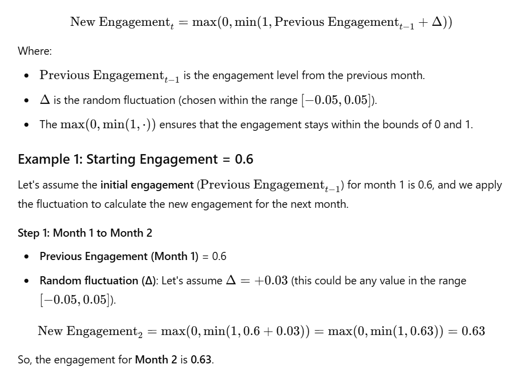{width="6.5in"
height="4.7027777777777775in"}

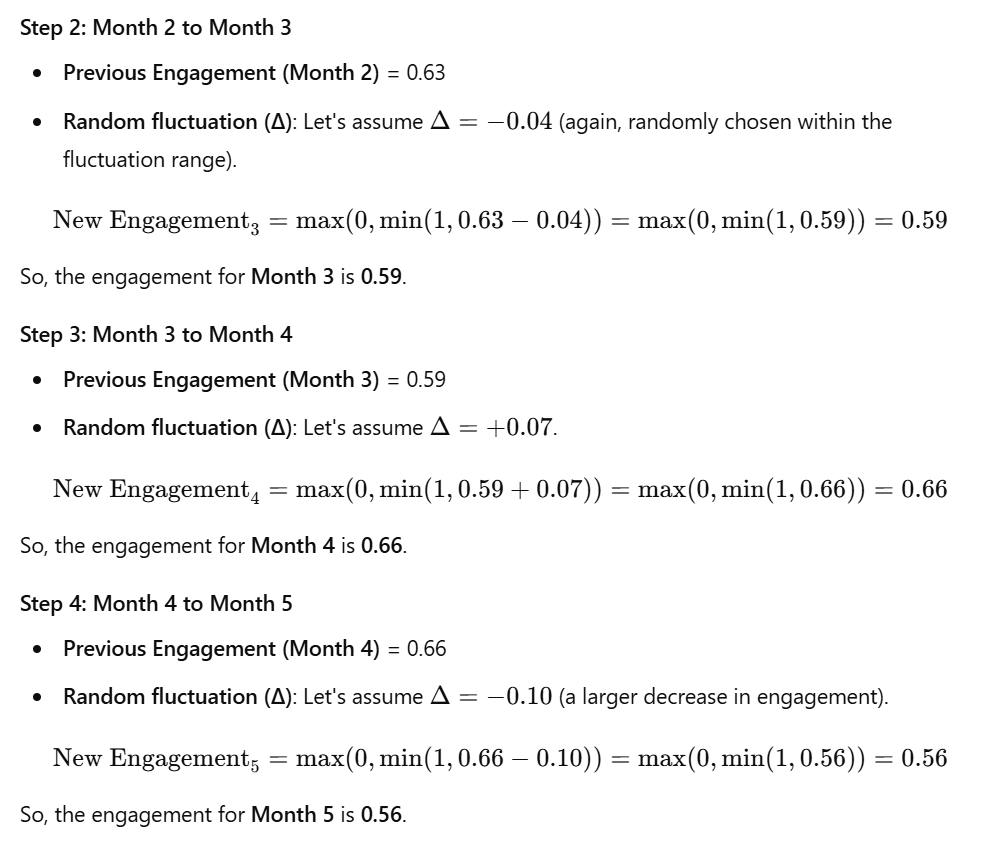{width="6.5in" height="5.60625in"}

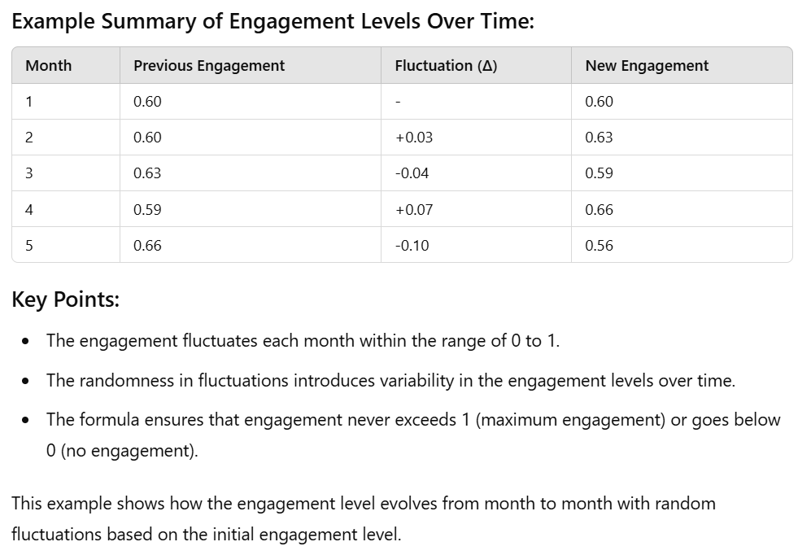{width="6.5in"
height="4.446527777777778in"}

The code simulates stakeholder engagement levels over time and analyzes
the impact of these engagement levels on a model\'s uptake rate. Let\'s
break down the key formulas and concepts used in this code:

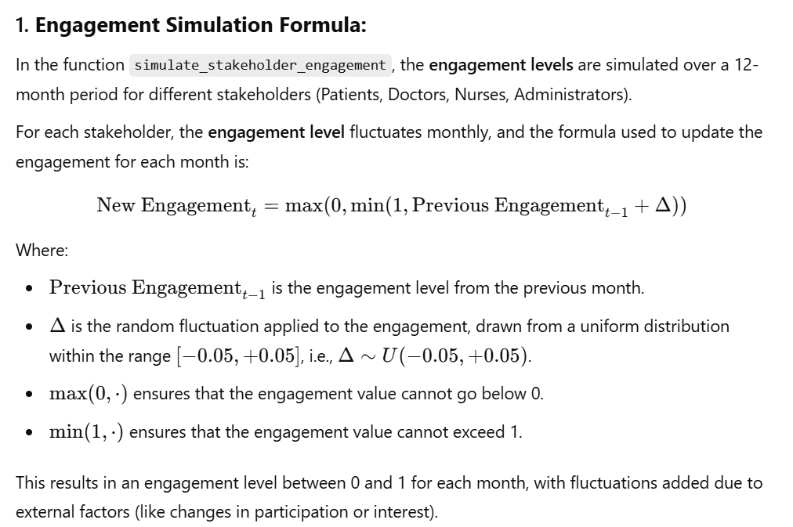{width="6.5in"
height="4.322916666666667in"}

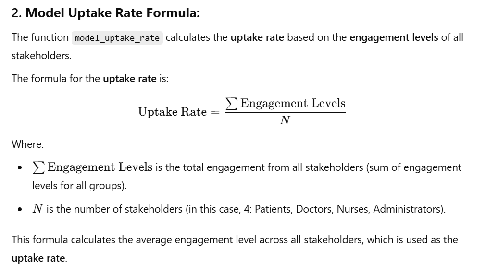{width="6.5in"
height="3.6708333333333334in"}

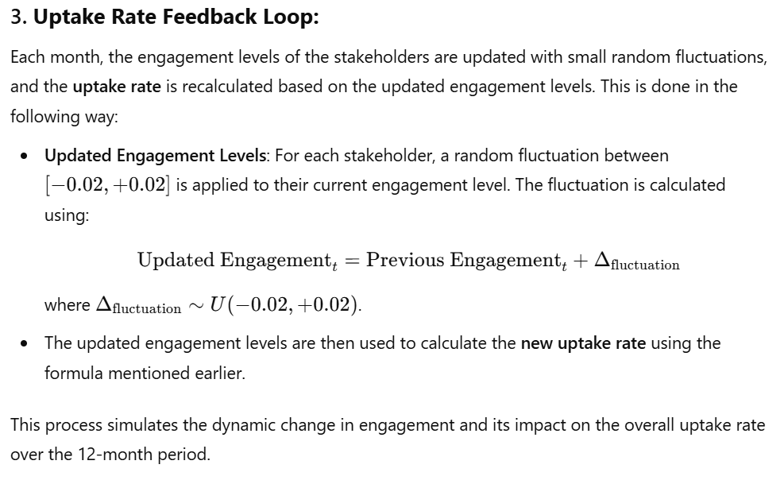{width="6.5in"
height="3.977777777777778in"}

**Summary of Key Formulas:**

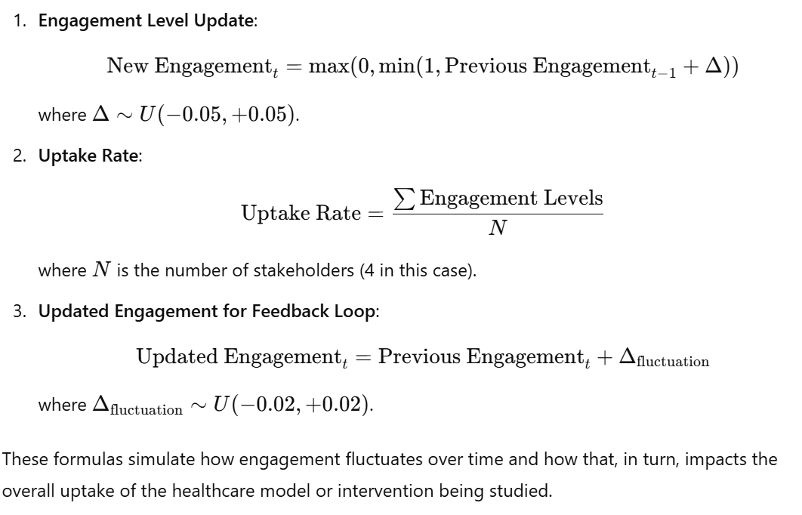{width="6.5in"
height="4.174305555555556in"}
